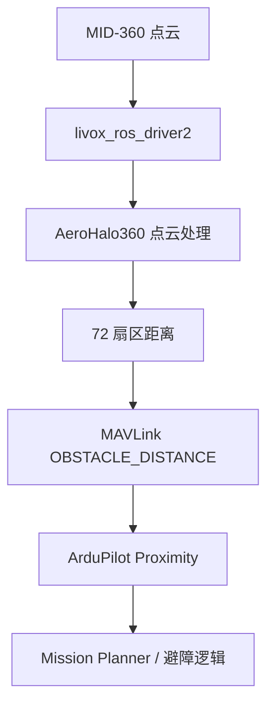

# AeroHalo360

AeroHalo360 是一个面向 ArduPilot 的 ROS 2 近距避障桥接模块：它把 Livox MID-360 发布的 `sensor_msgs/msg/PointCloud2` 点云压缩为 72 个、每个 5° 的水平扇区，并通过 MAVLink 2 `OBSTACLE_DISTANCE` 发送给飞控，用于 Mission Planner Proximity 可视化，以及后续的 Simple Avoidance / BendyRuler 联调。

> **项目状态：Alpha。** 当前版本已完成 Jetson Orin Nano + ROS 2 Humble + Livox MID-360 + CUAV X7+/ArduPilot 的台架链路验证，但尚未完成安装方向、机体自遮挡、地面反射、距离精度、时延和真实飞行验证。**不能把 Mission Planner 中出现图形等同于已经具备安全避障能力。**


## 1. 已验证的参考环境

| 项目 | 参考配置 |
| --- | --- |
| 机载计算机 | NVIDIA Jetson Orin Nano，Ubuntu 22.04，ARM64 |
| ROS | ROS 2 Humble |
| 激光雷达 | Livox MID-360 |
| 雷达驱动 | `livox_ros_driver2`，输出 `PointCloud2` |
| 飞控 | CUAV X7+，ArduPilot Copter |
| 地面站 | Mission Planner |
| 点云话题 | `/livox/lidar`，约 10 Hz |
| 扇区话题 | `/aero_halo_360/sector_distances`，约 10 Hz |
| MAVLink | MAVLink 2 `OBSTACLE_DISTANCE` |

本文中的示例地址来自一次真实台架验证：

- Jetson 雷达网口：`192.168.1.50/24`
- MID-360 序列号末两位：`58`
- 对应出厂地址：`192.168.1.158`

请按自己的网卡名、雷达序列号、串口设备和安装尺寸替换示例值，不要照抄硬件唯一标识。

## 2. 系统数据流



AeroHalo360 不控制电机，也不替代飞控。它只提供障碍物距离；最终是否停止、绕行或继续任务由 ArduPilot 模式及参数决定。

当前输出是**水平 360° 扇区**，不提供可靠的向上/向下避障，也不能替代地形跟随、测高或降落保护。

## 3. 安全边界

在任何带桨测试前，至少完成以下事项：

- 备份全部飞控参数，并保留可靠的人工接管和急停方式。
- 在拆桨、空桨或可靠物理约束下完成前、右、后、左四方向测试。
- 建立并验证 `base_link -> livox_frame` 静态变换，不能用临时 `target_frame:=livox_frame` 代替飞行标定。
- 测量机体和脚架，重做 `self_mask` 与高度过滤参数。
- 验证拔网线、关闭雷达、停止驱动、TF 丢失和 Jetson 重启时的降级行为。
- 从低速、空旷、软障碍物、保护网环境开始飞行测试。

### USB 只用于台架联调

今天验证成功的链路是 Jetson 通过飞控原生 USB 口连接 `/dev/ttyACM0`。这非常适合拆桨调试，但不应作为默认飞行拓扑。ArduPilot 官方文档提示，USB 供电/连接会让飞控按台架状态处理，可能改变部分失效保护行为。正式飞行建议改为 Jetson UART 连接飞控空闲的 TELEM 口，并依据飞控板卡手册核对电平、线序和串口映射。

### “虚拟墙”不是整机掉电保护

fail-closed 虚拟墙只有在 **MAVLink sender、Jetson 电源和飞控链路仍然存活**时才能发出。点云处理节点停止而 sender 仍在时，它可以发送超时墙；但 sender 崩溃、Jetson 掉电或 USB/UART 断开时，飞控不会收到新的虚拟墙。正式飞行前必须分别测试这些故障，并验证 ArduPilot 在 Proximity 数据超时后的模式行为、遥控接管和必要的飞控侧降级策略。

## 4. 硬件连接

### 4.1 推荐拓扑

**拆桨台架：**

- MID-360 Ethernet → Jetson 独立以太网口
- Jetson USB → 飞控原生 USB
- Mission Planner → 飞控另一条独立遥测链路

**正式飞行：**

- MID-360 Ethernet → Jetson 独立以太网口
- Jetson UART → 飞控空闲 TELEM 口
- Mission Planner → 另一条遥测链路

同一个 `/dev/ttyACM*` 或 `/dev/ttyTHS*` 不能同时被 AeroHalo360、MAVProxy、MAVLink Router 或其他程序独占打开。需要共享单链路时，应明确部署 MAVLink Router，而不是让两个程序直接抢串口。

### 4.2 供电与布线

- 不要使用 TELEM 口的 5 V 引脚给 Jetson 供电。
- MID-360 的 RJ45 是数据接口，**不要接入 PoE 交换机或 PoE 注入器**。
- Jetson、MID-360 和飞控使用满足峰值功耗的稳压电源，并可靠共地。
- UART 使用兼容的 3.3 V 电平，TX/RX 交叉连接，GND 相连；上电前查阅飞控针脚定义。
- 雷达网线、UART 和电源线与电机/电调大电流线分开固定。

## 5. 安装基础软件

以下命令以源码位于 `~/AeroHalo360_ws/src/aero-halo-360` 为例。

### 5.1 ROS 2 与依赖

Ubuntu 22.04 使用 ROS 2 Humble：

```bash
cd ~/AeroHalo360_ws/src/aero-halo-360
bash nano_deploy/00_install_ros2_humble.sh
bash nano_deploy/01_install_dependencies.sh
```

如果 `apt` 已完成但 `rosdep update` 因 GitHub、代理或 DNS 超时而退出，可先确认显式依赖和 `pymavlink`：

```bash
source /opt/ros/humble/setup.bash
python3 -m pip install --user --upgrade pymavlink
python3 -c 'import pymavlink; print(pymavlink.__file__)'
```

然后在网络恢复后重试：

```bash
rosdep update
```

不要因为 `apt update` 对某个无关 PPA 报警就立即重装系统；先区分 ROS 2 软件包是否成功安装，以及真正失败的是 `apt`、`rosdep` 还是 DNS。

### 5.2 安装 Livox SDK2 与 ROS 2 驱动

参考官方仓库安装：

- [Livox-SDK2](https://github.com/Livox-SDK/Livox-SDK2)
- [livox_ros_driver2](https://github.com/Livox-SDK/livox_ros_driver2)

一种常见目录布局如下：

```bash
mkdir -p ~/ws_livox/src
cd ~/ws_livox/src
git clone https://github.com/Livox-SDK/livox_ros_driver2.git
```

先按 Livox-SDK2 官方说明完成编译与安装，再编译驱动：

```bash
cd ~/ws_livox/src/livox_ros_driver2
source /opt/ros/humble/setup.bash
./build.sh humble
```

驱动不包含在 AeroHalo360 包内；AeroHalo360 只订阅它发布的点云。

## 6. MID-360 网络与 IP 配置

### 6.1 确认 Jetson 网卡

```bash
ip -br link
ip -br -4 addr
```

参考台架中，雷达连接 `enP8p1s0`，Jetson 地址为 `192.168.1.50/24`。临时配置示例：

```bash
sudo ip link set enP8p1s0 up
sudo ip addr replace 192.168.1.50/24 dev enP8p1s0
```

正式部署应通过 NetworkManager 或 Netplan 配成静态地址，避免重启后丢失。雷达网口不要设置与 Wi-Fi 相同的子网，也不要同时配置两个相同的 `192.168.1.0/24` 路由。

### 6.2 由序列号推导出厂 IP

MID-360 的默认 IPv4 形式为 `192.168.1.1XX`，其中 `XX` 是序列号末两位十进制数字。例如末两位为 `58`：

```text
192.168.1.158
```

验证：

```bash
ping -c 4 192.168.1.158
ip neigh show dev enP8p1s0
```

如果雷达曾在 Livox Viewer 2 中改过地址，序列号规则不再代表当前地址，应以实际配置为准。`Destination Host Unreachable` 通常表示地址、网卡、供电或物理连接有问题，不是 ROS 话题问题。

### 6.3 修改 `MID360_config.json`

编辑**源码工作空间**中的文件，例如：

```bash
nano ~/ws_livox/src/livox_ros_driver2/config/MID360_config.json
```

关键字段应类似：

```json
{
  "MID360": {
    "lidar_net_info": {
      "cmd_data_port": 56100,
      "push_msg_port": 56200,
      "point_data_port": 56300,
      "imu_data_port": 56400,
      "log_data_port": 56500
    },
    "host_net_info": {
      "cmd_data_ip": "192.168.1.50",
      "cmd_data_port": 56101,
      "push_msg_ip": "192.168.1.50",
      "push_msg_port": 56201,
      "point_data_ip": "192.168.1.50",
      "point_data_port": 56301,
      "imu_data_ip": "192.168.1.50",
      "imu_data_port": 56401,
      "log_data_ip": "",
      "log_data_port": 56501
    }
  },
  "lidar_configs": [
    {
      "ip": "192.168.1.158",
      "pcl_data_type": 1,
      "pattern_mode": 0,
      "extrinsic_parameter": {
        "roll": 0.0,
        "pitch": 0.0,
        "yaw": 0.0,
        "x": 0.0,
        "y": 0.0,
        "z": 0.0
      }
    }
  ]
}
```

四个 `*_data_ip`/`push_msg_ip` 是 **Jetson 的地址**；`lidar_configs[].ip` 才是 **雷达地址**。AeroHalo360 自己不会修改雷达网络，仓库配置中的 `radar.ip` 若存在也只是记录信息。

校验 JSON 并重新编译/安装驱动：

```bash
python3 -m json.tool \
  ~/ws_livox/src/livox_ros_driver2/config/MID360_config.json >/dev/null

cd ~/ws_livox/src/livox_ros_driver2
source /opt/ros/humble/setup.bash
./build.sh humble
```

如果修改了 `src/.../MID360_config.json`，但运行时仍读取 `install/.../MID360_config.json` 的旧值，说明没有重新构建或没有 source 正确的工作空间。不要长期只手改 `install/`，因为下次构建会覆盖它。

## 7. 启动并验证 MID-360

新终端中运行：

```bash
source /opt/ros/humble/setup.bash
source ~/ws_livox/install/setup.bash
ros2 launch livox_ros_driver2 rviz_MID360_launch.py
```

本项目要求 `/livox/lidar` 的类型为 `sensor_msgs/msg/PointCloud2`。某些 Livox launch 文件默认发布自定义消息；若使用自定义 launch，请明确选择 PointCloud2 输出。已验证的 `rviz_MID360_launch.py` 会提供所需话题。

另开终端检查：

```bash
source /opt/ros/humble/setup.bash
source ~/ws_livox/install/setup.bash

ros2 topic list | grep -E 'livox|lidar|imu'
ros2 topic type /livox/lidar
ros2 topic info /livox/lidar -v
ros2 topic hz /livox/lidar
```

通过标准：

- `/livox/lidar` 存在且 Publisher count 为 1；
- 类型为 `sensor_msgs/msg/PointCloud2`；
- 稳定约 10 Hz；
- `/livox/imu` 存在。

`ros2 topic hz` 刚启动时可能先显示一次 “does not appear to be published yet”，随后出现稳定频率即可；持续没有数据才是故障。

## 8. 编译 AeroHalo360

```bash
cd ~/AeroHalo360_ws
source /opt/ros/humble/setup.bash
colcon build --packages-select aero_halo_360 --symlink-install
source install/setup.bash
ros2 pkg prefix aero_halo_360
```

发布包可用低峰值内存构建：

```bash
cd ~/AeroHalo360_ws/src/aero-halo-360
bash nano_deploy/02_build_release.sh
bash nano_deploy/03_check_environment.sh
```

## 9. 连接飞控

### 9.1 拆桨台架：USB

发现设备：

```bash
lsusb
lsusb -t
ls -l /dev/serial/by-id 2>/dev/null || true
find /dev -maxdepth 1 -type c \
  \( -name 'ttyTHS*' -o -name 'ttyUSB*' -o -name 'ttyACM*' \) -print
groups
```

优先使用不会随重启变化的 `/dev/serial/by-id/...`，不要在部署配置中硬编码 `/dev/ttyACM0`。参考台架设备为：

```text
/dev/serial/by-id/usb-ArduPilot_Pixhawk1_<硬件唯一ID>-if00
```

确保当前用户属于 `dialout`：

```bash
sudo usermod -aG dialout "$USER"
```

注销并重新登录后再检查。确认串口没有被占用：

```bash
sudo fuser -v /dev/ttyACM0
```

用心跳验证“真的连到飞控”，而不只是“串口能打开”：

```bash
export PORT=/dev/serial/by-id/usb-ArduPilot_Pixhawk1_<硬件唯一ID>-if00

MAVLINK20=1 python3 - <<'PY'
import os
from pymavlink import mavutil

port = os.environ['PORT']
m = mavutil.mavlink_connection(port, baud=115200)
heartbeat = m.wait_heartbeat(timeout=10)
if heartbeat is None:
    raise SystemExit('10 秒内未收到飞控心跳')
print(f'收到飞控心跳：system={m.target_system}, component={m.target_component}')
m.close()
PY
```

USB CDC 的 `baud` 通常不是实际物理波特率，但仍需给库传入一个合法值；本次台架使用 `115200`。

### 9.2 正式飞行：TELEM UART

以 CUAV X7+ 的空闲 TELEM2 映射到 ArduPilot `Serial2` 为例，常见起点为：

```text
SERIAL2_PROTOCOL = 2       # MAVLink 2
SERIAL2_BAUD     = 921     # 921600 bit/s
BRD_SER2_RTSCTS  = 0       # 不接硬件流控时关闭；仅在固件提供该参数时设置
```

Jetson 端可能是 `/dev/ttyTHS1` 或 `/dev/ttyTHS2`。**必须根据载板原理图、Jetson pinmux 和飞控板卡文档确认，不能仅凭设备名猜测。** 先从 115200 或 460800 做稳定性验证，再评估 921600；高波特率不是越高越可靠。

## 10. 启动完整链路

保持 Livox 驱动终端运行。另开终端：

```bash
source /opt/ros/humble/setup.bash
source ~/ws_livox/install/setup.bash
source ~/AeroHalo360_ws/install/setup.bash

export FC_PORT=/dev/serial/by-id/usb-ArduPilot_Pixhawk1_<硬件唯一ID>-if00

ros2 launch aero_halo_360 aero_halo_360.launch.py \
  input_topic:=/livox/lidar \
  target_frame:=livox_frame \
  start_mavlink:=true \
  mavlink_connection:="$FC_PORT" \
  mavlink_baud:=115200 \
  publish_filtered_cloud:=false \
  publish_markers:=false \
  publish_diagnostics:=true
```

这里的 `target_frame:=livox_frame` **只用于先打通 Mission Planner 可视化**，避免缺少 TF 时点云处理完全停止。它不能保证图中的前后左右就是机体方向，正式飞行必须改为 `target_frame:=base_link` 并提供经过验证的静态 TF。

检查节点与输出：

```bash
ros2 node list
ros2 topic hz /aero_halo_360/sector_distances
ros2 topic echo /aero_halo_360/diagnostics --once
ros2 topic echo /aero_halo_360/mavlink_diagnostics --once
ros2 topic echo /aero_halo_360/sector_distances --once
```

健康输出应包含：

```text
cloud_processor: status_code=0, degraded=false
mavlink_obstacle_sender: MAVLINK_CONNECTED; OK
has_sector_input=true
sending_distances=true
```

注意：旧配置中 `wait_heartbeat_on_connect=false` 时，`MAVLINK_CONNECTED` 只代表端口已打开并且发送没有抛异常，不能单独证明飞控收到消息；应同时执行心跳测试和 Mission Planner Inspector 检查。

### 10.1 扇区含义

默认机体系约定为 ROS FLU：`+X` 前、`+Y` 左、`+Z` 上。

| 方向 | 扇区索引 | MAVLink 角度 |
| --- | ---: | ---: |
| 前 | `0` | `0°` |
| 右 | `18` | `90°` |
| 后 | `36` | `180°` |
| 左 | `54` | `270°` |

常见数值解释：

- 正常厘米值：该方向最近障碍距离；
- `max_distance_cm + 1`，例如 `1001`：配置量程内未发现障碍；
- 72 个值全部为 `80` 且状态为 `DEGRADED_*`：Watchdog 进入 80 cm 虚拟墙，不是真实障碍；
- 话题完全消失：节点或驱动已停止，先查 Publisher count。

## 11. Mission Planner 配置

以下步骤先完成**可视化**，不立即启用自动避障。不同 ArduPilot 版本的参数名和端口编号可能不同；修改前先保存参数文件，并在 Mission Planner 中搜索确认参数存在。

### 11.1 Proximity 输入

在 Mission Planner 的 Full Parameter Tree/List 中设置：

```text
PRX1_TYPE = 2    # MAVLink
```

写入参数后重启飞控。若已有其他 Proximity 传感器占用 `PRX1`，应改用空闲实例，并同步调整相应 `PRXn_*` 参数。

### 11.2 两条 MAVLink 端口

以“Jetson 接飞控 USB，Mission Planner 接 TELEM1”为例：

```text
SERIAL0_PROTOCOL = 2       # 飞控原生 USB / MAVLink 2
SERIAL1_PROTOCOL = 2       # TELEM1 / MAVLink 2
```

保持 Mission Planner 已经稳定连接的 `SERIAL1_BAUD`，不要为了本项目盲目改变数传波特率。

CUAV X7 系列的常见映射是 `SERIAL0=USB`、`SERIAL1=TELEM1`、`SERIAL2=TELEM2`，仍应以当前板卡文档为准。TELEM1 只接 TX/RX/GND 时，如果固件提供该参数，可设置 `BRD_SER1_RTSCTS=0`。`SERIAL1_BAUD=57` 通常代表 57600，`115` 代表 115200，而不是直接填写完整数字。

### 11.3 允许消息接收与转发

`OBSTACLE_DISTANCE` 没有 target 字段。ArduPilot 在 MAVLink 路由启用时会在端口间转发，并把数据交给 Proximity 后端。检查以下选项：

```text
MAV_OPTIONS = 0
```

`MAV_OPTIONS` 的 bit 0 若置位，会只接受配置范围内的 GCS system ID，可能拒绝伴随计算机消息。本项目的已验证台架保持为 `0`。

ArduPilot 4.7 及更新版本，在本节端口顺序下 USB 是第一个 MAVLink 通道、TELEM1 是第二个，检查：

```text
(MAV1_OPTIONS & 2) == 0    # USB 未置位 No Forward
(MAV2_OPTIONS & 2) == 0    # TELEM1 未置位 No Forward
```

ArduPilot 4.6 及更早版本，相同转发禁止位通常在物理串口 options 的 bit 10：

```text
(SERIAL0_OPTIONS & 1024) == 0
(SERIAL1_OPTIONS & 1024) == 0
```

`MAVx` 的编号表示 MAVLink 通道顺序，不是可以在所有硬件上直接等同于 `SERIALx` 的编号。

不要机械覆盖其他已配置的签名、路由或高延迟选项；先读取现值并按当前固件参数说明判断。

伴随计算机通常与飞控使用相同 system ID、不同 component ID。本项目默认 `source_system=1`、`source_component=191`；如果 ArduPilot 的 `MAV_SYSID`（旧版为 `SYSID_THISMAV`）不是 `1`，应同步修改 sender 的 `mavlink.source_system`。

### 11.4 Mission Planner 刷新率

`MAVx_EXTRA3`/旧版 `SRx_EXTRA3` 控制飞控在指定地面站链路上生成的一组 EXTRA3 遥测消息，其中包括 `DISTANCE_SENSOR`，但**它不是 Jetson `OBSTACLE_DISTANCE` 转发开关**。

如果 Mission Planner 在 TELEM1：

```text
# ArduPilot 4.7+ 常见命名
MAV2_EXTRA3 = 5

# 较旧固件常见命名
SR1_EXTRA3  = 5
```

可在链路带宽充足时临时调到 `10` 改善台架刷新；如果出现丢包或其他遥测变慢，退回 `5`。端口映射以当前固件参数说明为准：不要因为参数名带 `2` 就想当然地认为它一定是 `SERIAL2`。

Mission Planner 可能通过 `REQUEST_DATA_STREAM` 覆盖流率。如果需要完全由飞控参数控制，可在 Mission Planner 的 Planner/Telemetry Rates 中将对应请求设为 `-1`；只有理解签名和流率影响时，才考虑使用 `MAV2_OPTIONS` 的相关选项。

### 11.5 仅可视化时关闭自动动作

```text
AVOID_ENABLE = 0
OA_TYPE      = 0
```

这样 Mission Planner 可以显示 Proximity，但飞控不会依据未标定数据主动避让。若固件提供 `PRX_FILT`，台架检查实时性时可临时降低或关闭其滤波；飞行前必须结合噪声重新评估。

### 11.6 在 Mission Planner 中检查

1. 连接飞控，等待参数加载完成。
2. 进入 **Flight Data**，按 `Ctrl+F` 打开隐藏工具。
3. 打开 **MAVLink Inspector**，勾选 **Show GCS Traffic**。
4. 在同一飞控 system ID 下查找 component `191` 的 `OBSTACLE_DISTANCE`，目标约 10 Hz；同时检查飞控 component `1` 生成的 `DISTANCE_SENSOR` 是否持续更新。不同 Mission Planner 版本的分组可能略有差异。
5. 返回 `Ctrl+F` 工具，打开 **Proximity**。
6. 使用窗口 `+` / `-` 调整显示半径。
7. 在雷达前、右、后、左依次放置纸箱或泡沫板，核对图中方向与距离。
8. 停止 Livox 驱动，确认界面出现虚拟墙/降级状态，而不是继续显示全向安全。

Mission Planner Proximity 中通常以 `0°` 为前方、`90°` 为右、`180°` 为后、`270°` 为左。四方向任一相反都必须先修正 TF/安装偏航，不能靠记忆在飞行中补偿。

官方参考：

- [ArduPilot Proximity Sensors](https://ardupilot.org/copter/docs/common-proximity-landingpage.html)
- [CUAV X7 Family Overview / Port Mapping](https://ardupilot.org/copter/docs/common-cuav-x7-family-overview.html)
- [ArduPilot Serial Port Configuration](https://ardupilot.org/copter/docs/common-serial-options.html)
- [ArduPilot MAVLink Routing](https://ardupilot.org/dev/docs/mavlink-routing-in-ardupilot.html)
- [ArduPilot MAVLink Configuration](https://ardupilot.org/copter/docs/common-mavlink-configuration.html)
- [ArduPilot Simple Object Avoidance](https://ardupilot.org/copter/docs/common-simple-object-avoidance.html)
- [ArduPilot Depth Camera / Proximity Test Flow](https://ardupilot.org/copter/docs/common-realsense-depth-camera.html)

## 12. 从“能显示”到“可以试飞”

### 12.1 建立正确的 LiDAR TF

正式运行应使用：

```bash
ros2 launch aero_halo_360 aero_halo_360.launch.py \
  target_frame:=base_link \
  use_static_lidar_tf:=true \
  lidar_parent_frame:=base_link \
  lidar_child_frame:=livox_frame \
  lidar_xyz:="<x> <y> <z>" \
  lidar_rpy:="<roll> <pitch> <yaw>"
```

`xyz` 单位为米，`rpy` 单位为弧度。MID-360 竖直安装时，官方坐标系的 `+X` 与 M12 接口方向相反。下表只能作为初始偏航猜测，最终必须通过四方向实测确认：

| M12 接口朝向 | 初始 yaw 参考 |
| --- | ---: |
| 机尾 | `0` |
| 机头 | `3.141593` |
| 机右 | `1.570796` |
| 机左 | `-1.570796` |

雷达测量原点不等于安装底面；应查阅 [MID-360 用户手册/下载页](https://www.livoxtech.com/mid-360/downloads) 并测量实际安装位置。

### 12.2 重做过滤与自遮挡

室内地面、机臂、脚架和支架会被当成近距离障碍。飞行前至少重新测量：

- `height_filter.z_min_m` / `z_max_m`
- `self_mask` 每个包围盒
- `range_filter.min_range_m`
- `vehicle.radius_m` 与 `safety_extra_m`
- `inflation.max_inflate_bins`
- `temporal_filter.clear_frames` / `receding_alpha`

默认自遮挡框只是示例，不代表任何具体机架已经标定。

### 12.3 时延与 Watchdog

链路目标为 10 Hz。台架中曾观察到单次点云间隔约 `0.332 s`，而旧默认 `cloud_timeout_ms=300`、`input_timeout_ms=300`，因此可能偶发进入虚拟墙并造成画面跳变。不要只为“看起来顺滑”关闭 fail-closed；应记录端到端时延，再选择有依据的超时、连续丢帧门限和恢复滞回。

台架追求显示实时性时，可以使用低滤波/低膨胀演示配置；飞行配置必须保留足够的去噪、障碍膨胀与失效保护。两套配置不要混用。

还必须分别验证：停止 Livox 驱动、杀死 cloud processor、杀死 sender、拔掉 MAVLink 线、关闭 Jetson 电源。只有前两种且 sender 仍存活时，当前软件才可能继续发虚拟墙；其余情况需要飞控侧超时和人工接管兜底。

### 12.4 后续启用 ArduPilot 避障

以下仅是低速验证起点，不是通用最终值：

```text
# Loiter Simple Avoidance 起点
PRX1_TYPE    = 2
AVOID_ENABLE = 7
AVOID_MARGIN = 2.0
AVOID_BEHAVE = 1
RCx_OPTION   = 40

# AUTO/GUIDED/RTL BendyRuler 起点
OA_TYPE         = 1
OA_BR_TYPE      = 1
OA_BR_LOOKAHEAD = 5
OA_MARGIN_MAX   = 2
OA_DB_SIZE      = 100
OA_DB_EXPIRE    = 2
OA_DB_OUTPUT    = 3
```

参数含义和可用范围随 ArduPilot 版本变化。先确认模式、方向、制动距离、速度上限和遥控器开关，再逐项启用；不要一次打开全部功能。

## 13. 常见问题

| 现象 | 最可能原因 | 检查/处理 |
| --- | --- | --- |
| `ping` 雷达失败 | IP 推导错误、雷达曾改 IP、网卡未配置、线缆/供电问题 | 核对 SN、`ip -br -4 addr`、Livox Viewer 2、物理链路 |
| `Package not found: livox_ros_driver2` | 没 source 驱动工作空间 | `source ~/ws_livox/install/setup.bash` |
| `/livox/lidar` Publisher count 为 0 | 驱动终端退出或配置未加载 | 重启驱动，检查运行时 JSON 路径 |
| 点云有 10 Hz，扇区话题没有 | AeroHalo360 未启动、TF 不存在、话题类型错误 | 查节点日志、`ros2 topic type`、TF |
| 72 个方向全部 `80 cm` | 点云/扇区超时后进入虚拟墙 | 查两个 diagnostics 和驱动频率，不要当真障碍 |
| 大量 `1001 cm` | 量程内没有有效点或点被过滤 | 查看过滤点数、范围/高度/self-mask 参数 |
| 室内四周都很近 | 地面、自机、支架反射与膨胀叠加 | 先做 TF、高度、自遮挡和膨胀标定 |
| `MAVLINK_CONNECTED` 但 MP 无数据 | 端口只打开未收到心跳、PRX 未启用、消息被路由选项过滤 | 心跳脚本、Inspector、`PRX1_TYPE`、`MAV*_OPTIONS` |
| Inspector 有数据，Proximity 空白 | PRX 后端未重启生效或查看了错误组件/实例 | 写入 `PRX1_TYPE=2` 后重启，勾选 GCS traffic |
| Proximity 更新慢 | EXTRA3 流率低、链路拥塞、ROS/点云滤波滞后 | 分层测量 Hz；先把地面站 EXTRA3 调到 5，带宽足够再试 10 |
| 串口 Permission denied | 用户不在 `dialout` 或未重新登录 | `usermod -aG dialout` 后注销登录 |
| 串口 busy | 另一程序占用设备 | `fuser -v`，停止冲突进程或部署 MAVLink Router |
| 关闭 SSH 后系统停止 | 节点仍在前台终端 | 调试用 `tmux`，部署用经本机路径配置过的 systemd 服务 |
| `rosdep update` 超时 | GitHub/代理/DNS 不可用 | 先确认显式依赖；恢复网络后重试，不要反复重装 ROS |

## 14. 测试

```bash
cd ~/AeroHalo360_ws
source /opt/ros/humble/setup.bash
source install/setup.bash

colcon test --packages-select aero_halo_360
colcon test-result --verbose
```

建议按以下顺序验收：

1. 合成点云单元测试；
2. MID-360 真实点云与 ROS diagnostics；
3. 不接飞控时的 72 扇区方向测试；
4. 拆桨 USB 心跳与 Mission Planner Proximity；
5. 分别执行断网、停驱动、杀 cloud、杀 sender、TF 错误、拔 MAVLink、Jetson 掉电等故障注入，并记录飞控行为；
6. 改用 TELEM UART 后重复全部台架测试；
7. 空桨/约束测试；
8. 低速空旷场地分阶段试飞。

## 15. 进程管理

开发阶段建议使用 `tmux` 分别运行 Livox 驱动和 AeroHalo360，便于保留日志。systemd 部署时不要直接使用仓库中的个人用户名或固定 `/home/...` 路径；应通过环境文件配置：

- 实际 Linux 用户和工作空间路径；
- 雷达网卡与静态 IP；
- `/dev/serial/by-id/...` 飞控路径；
- ROS domain、配置文件和日志目录；
- Livox 驱动启动顺序与 AeroHalo360 健康依赖。

服务启动成功不等于传感器健康；上线前仍需检查 `/aero_halo_360/diagnostics` 和 `/aero_halo_360/mavlink_diagnostics`。

## 16. 目录结构

```text
aero-halo-360/
├── aero_halo_360/
│   ├── config/       # ROS 参数与安装示例
│   ├── include/      # C++ 处理模块
│   ├── launch/       # ROS 2 launch
│   ├── msg/          # SectorDistances
│   ├── scripts/      # MAVLink、回放与调试工具
│   ├── src/          # 点云处理节点
│   └── test/         # 单元测试
├── docs/             # 架构、安全、调参与测试文档
├── nano_deploy/      # Jetson 部署脚本
├── systemd/          # 服务模板
├── LICENSE
└── README.md
```

## 17. 贡献与问题报告

提交 issue 时请附上：

- Jetson/Ubuntu/ROS/ArduPilot/驱动版本；
- MID-360 当前 IP 与 Jetson 网卡地址（隐藏硬件唯一序列号）；
- `ros2 topic info -v`、两个 diagnostics 和相关节点日志；
- 飞控参数文件或最小相关参数；
- 安装方向、TF、自遮挡配置；
- 可复现步骤及是否已拆桨。

请勿在公开 issue 中上传 Wi-Fi 密码、SSH 密钥、完整设备序列号或其他凭据。

## 18. License

本项目按 [Apache License 2.0](LICENSE) 开源。第三方组件（ROS 2、Livox SDK/驱动、pymavlink、ArduPilot、Mission Planner）分别遵循其自身许可证。
